### AI / ML Engineer · Intelligent Systems · Applied AI

I build practical AI systems that turn ideas into software.

`Document AI` · `Computer Vision` · `Deep Learning` · `LLMs` · `AI Automation`

[GitHub](https://github.com/thejuspk07) · [LinkedIn](https://linkedin.com/in/thejus-pk) · [Portfolio](https://portfolio-cxt.pages.dev)

---

## What I build

AI systems that can **see, understand, reason, and act**.

---

## Selected work

**[ClaimBridge](https://github.com/thejuspk07/ClaimBridge)** — Document AI · OCR · Validation

**[Multi-Sensor Anomaly Detection](https://github.com/thejuspk07/LSTM-Based-Multi-Sensor-Anomaly-Detection)** — LSTM · Sensor Fusion

**[Sentiment Analysis](https://github.com/thejuspk07/Sentiment-Analysis-of-Tweets)** — NLP · ML

---

## Stack

`Python` `PyTorch` `TensorFlow` `OpenCV` `FastAPI` `React` `SQL` `Git`

---

### BUILD · SHIP · LEARN · ITERATE
